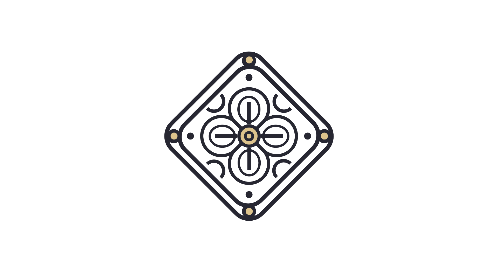

## Foundry Casino Heist



A Collection of Casino Heist's Challenges written in Foundry- Perfect for those who doesn't want to deploy anything and want to exercise their Test Writting skill in Foundry.

You can find the reading material in our website at [Casino Heist](https://casinoheist.enuma-labs.xyz).

## Requirement

What you need to prepare:

1. [Foundry](https://book.getfoundry.sh/)
2. Snacks 🍫🍪

## Mini-Guide

This is the directory and its usage.

- `/src` - all vulnerable contracts here.
- `/test` - all test files
- `/reading-mats/docs` - all vulnerabilities Explanation (Archived Version from CasinoHeist.v0)
- `/reading-mats/Mithrough` - all Mitigations & Walkthroughs (Archived Version from CasinoHeist.v0)

## How to Play

1. Clone the Repository

```shell
$ git clone https://github.com/Kiinzu/foundry-casino-heist.git
$ cd /foundry-casino-heist
$ forge install foundry-rs/forge-std \
    OpenZeppelin/openzeppelin-contracts \
    OpenZeppelin/openzeppelin-contracts-upgradeable \
    OpenZeppelin/openzeppelin-foundry-upgrade 
```

2. You will find the Challenge in the `/src` accordingly to their Category.

   - Basic (Introductory)
   - Common (Common Vulnerabilities)
   - VIP (Easier Stuff, trust me)
3. You will find all the test in one folder `/test` (Basic, Common, VIP in one place).
4. Some might require you to write Exploit Contract, some you can just edit the Test Directly. There will be `// Write Exploit Here`, that's the only place you should edit and some may include `vm.warp()`, you might also want to change this if you think you need it.

```solidity
// Example: test/MasterOfBlackjack.t.sol
    function testIfSolved() public {
        // Setup for Player
        vm.startPrank(player, player);
        vm.deal(player, 1 ether);

        // Write Exploit here
        vm.warp(19); // Feel free to change this to any block.timestamp that satisfy the requirement

        vm.stopPrank();
        assertEq(challSetup.isSolved(), true);
    }
```

⚠️ - **Do Not Change the Setup for player!**

5. To Test if the challenge is solved, simply run `make` - Since there are challenges that can be deployed and challenge that can be solve only using the Testfile, there are different way to play and solve the challenge

```shell
# Example of Foundry Test Challenge
# Example for vip_bank-of-people (Test)
$ make vip_bank-of-people

# Example of Deployed Challenge (Anvil)
# Example for deploy_basic_briefing
# Deploying Briefing in Local Anvil, will return credential for player
$ make deploy_basic_briefing 
> == Logs ==
  ========== DEPLOYING SETUP ==========
  Setup deployed at: 0x5FbDB2315678afecb367f032d93F642f64180aa3
  ====================================
  
  ========== PLAYER SETUP ==========
  Player Address    :  0x70997970C51812dc3A010C7d01b50e0d17dc79C8
  Player Private Key:  40606737760334725431406512677033654118342507952694270066784247067953537247501
  Player Balance    :  1 ether
  ====================================

$ make solve_basic_briefing
> == Logs ==
    ========== CHECKING SOLUTION ==========
    Setup at          :  0x5FbDB2315678afecb367f032d93F642f64180aa3
    First Celebrator  :  0x3C44CdDdB6a900fa2b585dd299e03d12FA4293BC
    Balance of Express:  0
    STATUS: NOT SOLVED
    ========================================
  [X] Challenge not solved yet
  [!] Destroying the Challenge Instance
  [!] Stopping Anvil...
  [o] Anvil stopped.  
  [!] Please create another instance by calling: 'make deploy_basic_briefing'
```

7. That's it! You good to go.

## Make List

Some challenges in Casino Heist are designed to be played on a **deployed Anvil Instance** using Foundry, while others can be solved in test mode or in their **deployed form**.

The table below litst the available modes for each challenge — **deployed**, **test**, or **both** — along with the **recommended way to play** each challenge.

| ///////////////////// | Test                         | Deployed                | Recommended |
| --------------------- | ---------------------------- | ----------------------- | ----------- |
| Briefing              | basic_briefing               | deploy_basic_briefing   | TBA         |
| Bulls Eye             | basic_bulls-eye              |                         | TBA         |
| Gearing Up            | basic_gearing-up             | deploy_basic_gearing-up | TBA         |
| Isolated              | basic_isolated               |                         | TBA         |
| Peek A Slot           | basic_peek-a-slot            |                         | TBA         |
| After You             | -                            | common_after-you        | TBA         |
| Bar                   | common_bar                   |                         | TBA         |
| Casino Vault          | common_casino-vault          |                         | TBA         |
| Cheap Glitch          | common_cheap-glitch          |                         | TBA         |
| Entry Point           | common_entry-point           |                         | TBA         |
| Gorengan              | common_gorengan              |                         | TBA         |
| Inju Bank             | common_inju-bank             |                         | TBA         |
| Master of Blackjack   | common_master-of-blackjack   |                         | TBA         |
| Roulette              | common_roulette              |                         | TBA         |
| Silent Dealer         | common_silent-dealer         |                         | TBA         |
| Singular Identity     | common_singular-identity     |                         | TBA         |
| Symbol of Noble       | common_symbol-of-noble       |                         | TBA         |
| Take My Money         | common_take-my-money         |                         | TBA         |
| Unlimited Credit Line | common_unlimited-credit-line |                         | TBA         |
| Voting Frenzy         | common_voting-frenzy         |                         | TBA         |
| VVVIP Member          | common_vvvip-member          |                         | TBA         |
| Casino Bankbuster     | advance_casino-bankbuster    |                         | TBA         |
| Double Dipping        | advance_double-dipping       |                         | TBA         |
| False Hope            | advance_false-hope           |                         | TBA         |
| Guardian              | advance_guardian             |                         | TBA         |
| Salt and Steel        | -                            | advance_salt-and-steel  | TBA         |
| The Waltz             | advance_the-waltz            |                         | TBA         |
| Bank of People        | vip_bank-of-people           |                         | TBA         |
| Executive Problems    | vip_executive-problems       |                         | TBA         |
| Inju's Gambit         | vip_inju-gambit              |                         | TBA         |
| IPWD                  | vip_ipwd                     |                         | TBA         |
| Pupol BFT             | vip_pupol-nft                |                         | TBA         |
